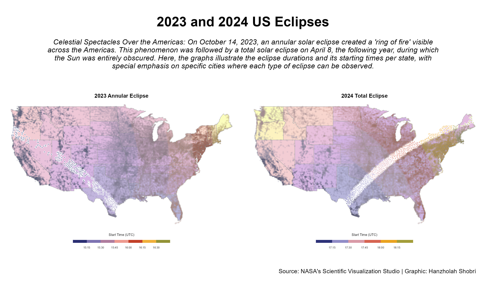

2023 & 2024 US Solar Eclipses

This week we're looking at the paths of solar eclipses in the United States. The data comes from NASA's Scientific Visualization Studio.

    On October 14, 2023, an annular solar eclipse [crossed] North, Central, and South America creating a path of annularity. An annular solar eclipse occurs when the Moon passes between the Sun and Earth while at its farthest point from Earth. Because the Moon is farther away from Earth, it does not completely block the Sun. This create[d] a “ring of fire” effect in the sky for those standing in the path of annularity. On April 8, 2024, a total solar eclipse will cross North and Central America creating a path of totality. During a total solar eclipse, the Moon completely blocks the Sun while it passes between the Sun and Earth. The sky will darken as if it were dawn or dusk and those standing in the path of totality may see the Sun’s outer atmosphere (the corona) if weather permits.

Which places are in both the 2023 path of annularity and the 2024 path of totality? Which place has the longest duration of totality in 2024?

